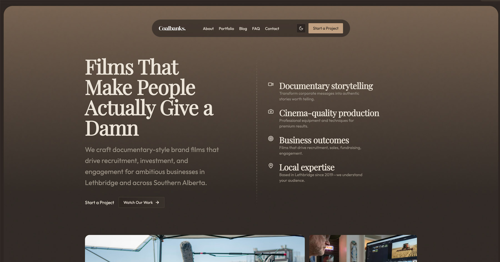

# cbanks-astro-october-2025

cbanks-astro-october-2025 is a modern website built with shadcn/ui, Tailwind 4 and Astro 5.

- [Demo](https://cbanks-astro-october-2025.vercel.app/)
- [Documentation](https://docs.shadcnblocks.com/templates/getting-started)



## Getting Started

```bash
npm install
```

```bash
npm run dev
```

Open [http://localhost:3000](http://localhost:3000) with your browser to see the result.

## Configuration

This project requires environment variables to be set for full functionality, particularly for the contact form.

1. Create a `.env` file in the root directory (you can use copies of `.env.local` or `.env.example` if available, or just create a new file).
2. Add the following variables:

```env
RESEND_API_KEY=re_123456789
```

> **Note**: The contact form uses [Resend](https://resend.com) for sending emails. You will need a valid API key.

## Features

### Core Technology Stack

- **Astro 5** built with Astro
- **Tailwind CSS 4** for styling
- **shadcn/ui** components
- **TypeScript** support
- **React 19**

### Key Features

- **Shadcn UI**: uses [shadcn/ui](https://ui.shadcn.com/) core UI components
- **Theme System**: Dark/light mode with `astro-themes`, compatible with [tweakcn](https://tweakcn.com)
- **MDX Support**: For content pages
- **Animations**: Motion library (Framer Motion) integration
- **Prettier**: Pre-configured code formatting
- **Custom Fonts**: DM Sans font family included
- **Icons**: Lucide React + React Icons libraries
- **Styleglide Integration**: For component previews/development
- **Responsive Design**: Mobile-friendly layout
- **SEO Ready**: Proper metadata and OG images included
- **Blog System**: Includes a complete blog system with SEO-friendly URLs and content guidelines
- **Performance Optimized**: Key components (Hero, Features, ResourceAllocation, Background) refactored to native Astro for minimal hydration and optimized image delivery. Achieving high Lighthouse scores.
- **Server-side API Endpoints**: Includes server-side API routes (e.g., for email sending) using Astro's hybrid rendering capabilities.

### Blog Content Guidelines

Blog posts are stored in `src/content/blog/` and follow specific guidelines for optimal SEO and user experience. See [docs/blog-guidelines.md](./docs/blog-guidelines.md) for detailed information on creating and formatting blog posts with proper slugs and frontmatter.

### Pre-built Pages

- Home/Landing page
- Services pages:
  - Drone Services
  - Event Coverage
  - Photography
  - Video Production
- About page
- Pricing page
- FAQ page
- Contact page with functional contact form (sending via Resend)
- Login/Signup pages
- Portfolio page with filtering and case studies

### Blocks

- Hero section
- Logo showcase/marquee
- Features section
- Resource allocation section
- Testimonials with carousel
- Pricing table
- FAQ with accordion
- Footer
- Navigation bar
- Featured Project section
- Portfolio Grid with filtering

## Deployment

Production-ready and tested for deployment on [Vercel](https://vercel.com)

## Credits

- Template by [shadcnblocks.com](https://shadcnblocks.com)
- Design by [Callum Flack](https://x.com/callumflack)
- Dev by [Yassine Zaanouni](https://x.com/YassineZaanouni)
- Produced by [Rob Austin](https://x.com/ausrobdev)

## ⚡️ Hydration & Interactive Components

### Using React Components

This project uses Astro as the main framework with React for interactive components. By default, Astro renders React components as static HTML.

**Important:** If you need a React component to be interactive (e.g., using `useState`, `useEffect`, or animation libraries like `framer-motion`), you **MUST** add a client directive when using the component in an `.astro` file.

Example:

```astro
<!-- Static (default) - No JS sent to client -->
<MyComponent />

<!-- Interactive - Hydrates immediately on load -->
<MyComponent client:load />

<!-- Interactive - Hydrates when visible in viewport -->
<MyComponent client:visible />
```

Common issues if client directive is missing:

- `onClick` handlers won't fire
- `useEffect` hooks won't run
- `framer-motion` animations won't play
